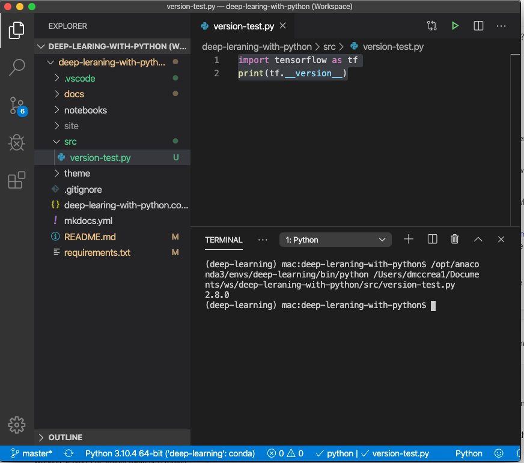
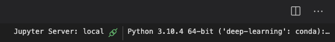

# Chapter 2: Getting Started

We demonstrate a setup using Conda, pip and VSCode.

## Setup for Doing Labs

```sh
conda create -n deep-learning python=3
conda activate
```
The first step may take 1-2 minutes.

## Downloading Tensorflow

```sh
pip install tensorflow
```
This might take about 2-3 minutes.

## Check Versions

We can use the pip freeze command to verify.

```sh
pip freeze
absl-py==1.0.0
astunparse==1.6.3
cachetools==5.0.0
certifi==2020.6.20
charset-normalizer==2.0.12
flatbuffers==2.0
gast==0.5.3
google-auth==2.6.3
google-auth-oauthlib==0.4.6
google-pasta==0.2.0
grpcio==1.44.0
h5py==3.6.0
idna==3.3
keras==2.8.0
Keras-Preprocessing==1.1.2
libclang==13.0.0
Markdown==3.3.6
numpy==1.22.3
oauthlib==3.2.0
opt-einsum==3.3.0
protobuf==3.20.0
pyasn1==0.4.8
pyasn1-modules==0.2.8
requests==2.27.1
requests-oauthlib==1.3.1
rsa==4.8
six==1.16.0
tensorboard==2.8.0
tensorboard-data-server==0.6.1
tensorboard-plugin-wit==1.8.1
tensorflow==2.8.0
tensorflow-io-gcs-filesystem==0.24.0
termcolor==1.1.0
tf-estimator-nightly==2.8.0.dev2021122109
typing_extensions==4.1.1
urllib3==1.26.9
Werkzeug==2.1.1
wrapt==1.14.0
```

## Testing Your TensorFlow Version

```py
import tensorflow as tf
print(tf.__version__)
```

return

```
2.8.0
```

## Configuring Visual Studio Code




Note the blue area at the bottom of the screen allows you to select the virtual environment.  In this case the label is:

```Python 3.10.4 64-bit ('deep-learning':conda)```

## Configuring Jypyter Notebook Kernel

Not only do we want to get the Python runtime, but we want to configure the Jupyter Notebook Kernel

On the upper right click on the kernel and then select the appropriate deep-learning conda environment:


