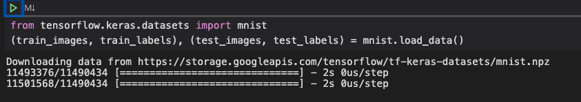

# Chapter 3: Running the MINST Demo

Import the MNIST dataset.  Put 60K into training and 10K into test.

```py
from tensorflow.keras.datasets import mnist
(train_images, train_labels), (test_images, test_labels) = mnist.load_data()
```



## Getting the Shape of Data

The shape function will tell is the dimensions of the input dataset:

```py
train_images.shape
```

```
(60000, 28, 28)
```

There are 60,000 training images that are 28 by 28 pixels.

```py
test_images.shape
```

```
(10000, 28, 28)
```

## TensorFlow Optimization Errors

```
2022-04-08 14:38:30.403775: I tensorflow/core/platform/cpu_feature_guard.cc:151] This TensorFlow binary is optimized with oneAPI Deep Neural Network Library (oneDNN) to use the following CPU instructions in performance-critical operations:  AVX2 FMA
To enable them in other operations, rebuild TensorFlow with the appropriate compiler flags.
```